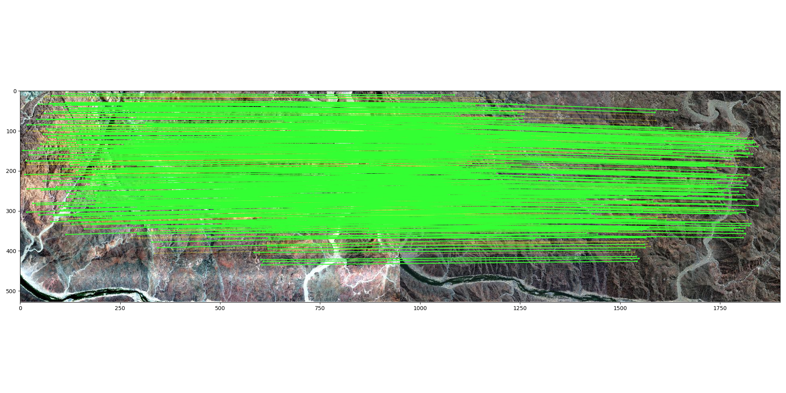

# RS_coreg_LoFTR

Setup the Kornia Environment
----------------------------
```console
python -m venv venv_kornia
cd venv_kornia
cd bin
./pip install kornia
./pip install kornia-rs
./pip install kornia_moons --no-deps
./pip install matplotlib
./pip install opencv-python --upgrade
./pip install requests
```

Setup this code
---------------
```console
cd venv_kornia
git clone https://github.com/YannChemin/RS_coreg_LoFTR.git
mv RS_coreg_LoFTR script
cd script/
```

Scripts of interest
-------------------
1_resize.sh (can be skipped initially)
```shell
# If you have more RAM set the larger image resolution
# WV3 image
cols=15821
rows=8776
# HyMap image
cols=3706
rows=1924
# S2 image
cols=950
rows=528
gdal_translate -co "WORLDFILE=YES" -outsize $cols $rows Namibia/EMIT_Haib_resize.tif EMIT_Haib_Kornia.jpg
#gdal_translate -co "WORLDFILE=YES" -outsize $cols $rows Namibia/S2_Haib_resize.tif S2_Haib_Kornia.jpg 
gdal_translate -co "WORLDFILE=YES" -outsize $cols $rows Namibia/HyMap_Haib_resized.tif HyMap_Haib_Kornia.jpg 
gdal_translate -co "WORLDFILE=YES" -outsize $cols $rows Namibia/WV3_Haib_resize.tif WV3_Haib_Kornia.jpg 
```
2_match.py (LoFTR common points identification)
```python
import cv2
import kornia as K
import kornia.feature as KF
import matplotlib.pyplot as plt
import numpy as np
import torch
from kornia.feature.adalam import AdalamFilter
from kornia_moons.viz import *

device = K.utils.get_cuda_or_mps_device_if_available()
print(device)

import io

import requests

fname1 = "HyMap_Haib_Kornia.jpg"
fname2 = "WV3_Haib_Kornia.jpg"

adalam_config = KF.adalam.get_adalam_default_config()
# adalam_config['orientation_difference_threshold'] = None
# adalam_config['scale_rate_threshold'] = None
adalam_config["force_seed_mnn"] = False
adalam_config["search_expansion"] = 16
adalam_config["ransac_iters"] = 256


img1 = K.io.load_image(fname1, K.io.ImageLoadType.RGB32, device=device)[None, ...]
img2 = K.io.load_image(fname2, K.io.ImageLoadType.RGB32, device=device)[None, ...]

num_features = 2048
disk = KF.DISK.from_pretrained("depth").to(device)

hw1 = torch.tensor(img1.shape[2:], device=device)
hw2 = torch.tensor(img2.shape[2:], device=device)

match_with_adalam = True

with torch.inference_mode():
    inp = torch.cat([img1, img2], dim=0)
    features1, features2 = disk(inp, num_features, pad_if_not_divisible=True)
    kps1, descs1 = features1.keypoints, features1.descriptors
    kps2, descs2 = features2.keypoints, features2.descriptors
    if match_with_adalam:
        lafs1 = KF.laf_from_center_scale_ori(kps1[None], 96 * torch.ones(1, len(kps1), 1, 1, device=device))
        lafs2 = KF.laf_from_center_scale_ori(kps2[None], 96 * torch.ones(1, len(kps2), 1, 1, device=device))

        dists, idxs = KF.match_adalam(descs1, descs2, lafs1, lafs2, hw1=hw1, hw2=hw2, config=adalam_config)
    else:
        dists, idxs = KF.match_smnn(descs1, descs2, 0.98)


print(f"{idxs.shape[0]} tentative matches with DISK AdaLAM")

def get_matching_keypoints(kp1, kp2, idxs):
    mkpts1 = kp1[idxs[:, 0]]
    mkpts2 = kp2[idxs[:, 1]]
    return mkpts1, mkpts2


mkpts1, mkpts2 = get_matching_keypoints(kps1, kps2, idxs)
f=open("gcps.csv", "w")
f.write("x_%s,y_%s,x_%s,y_%s\n"%(fname1,fname1,fname2,fname2))
for i in range(len(mkpts1)):
    f.write("%d,%d,%d,%d\n" % (int(mkpts1[i][0]),int(mkpts1[i][1]),int(mkpts2[i][0]),int(mkpts2[i][1])))
f.close()

Fm, inliers = cv2.findFundamentalMat(
    mkpts1.detach().cpu().numpy(), mkpts2.detach().cpu().numpy(), cv2.USAC_MAGSAC, 1.0, 0.999, 100000
)
inliers = inliers > 0
print(f"{inliers.sum()} inliers with DISK")

draw_LAF_matches(
    KF.laf_from_center_scale_ori(kps1[None].cpu()),
    KF.laf_from_center_scale_ori(kps2[None].cpu()),
    idxs.cpu(),
    K.tensor_to_image(img1.cpu()),
    K.tensor_to_image(img2.cpu()),
    inliers,
    draw_dict={"inlier_color": (0.2, 1, 0.2), "tentative_color": (1, 1, 0.2, 0.3), "feature_color": None, "vertical": False},
)
plt.rcParams['figure.figsize'] = [22, 16]
plt.tight_layout()
plt.savefig("GCP_coreg_Haib.png")
plt.show()
```
This creates a matching point set in `gcps.csv` and a plot like this one:


3_colrow2xy.py (converts one part of the [col,row] in `gcps.csv` into projected coordinates
```python
import rasterio
from affine import Affine
# https://affine.readthedocs.io/en/latest/index.html

img1 = 'HyMap_Haib_Kornia.jpg'
img2 = 'WV3_Haib_Kornia.jpg'
imgout = 'HyMap_Haib_Kornia_coreg_WV3.tif'

ds1 = rasterio.open(img1)
ds2 = rasterio.open(img2)

# Using rasterio and affine
gt1 = ds1.get_transform()
gt2 = ds2.get_transform()
#print(gt1)
#print(gt2)
fwd1 = Affine.from_gdal(*gt1)
fwd2 = Affine.from_gdal(*gt2)

import csv
print("gdal_translate -co \"WORLDFILE=YES\" ", end='')
gcps = []
with open('gcps.csv') as csvfile:
    reader = csv.DictReader(csvfile)
    headers = reader.fieldnames
    #print(headers)
    for row in reader:
        # col, row to x, y
        #x, y = fwd * (col, row)
        proj_x, proj_y = fwd2 * (int(row[headers[2]]),int(row[headers[3]]))
        gcps.append([int(row[headers[0]]),int(row[headers[1]]),round(proj_x,6),round(proj_y,6)])

# Sort and merge duplicates in list
# print(gcps)
from collections import defaultdict

def calculate_average(values):
    a_values = [item[0] for item in values]
    b_values = [item[1] for item in values]

    avg_a = sum(a_values) / len(a_values)
    avg_b = sum(b_values) / len(b_values)
    return [int(avg_a), int(avg_b), values[0][2], values[0][3]]

def group_and_average(data):
    grouped_data = defaultdict(list)

    for item in data:
        # Convert the inner list to a tuple to make it hashable
        tuple_item = tuple(item[2:])
        grouped_data[tuple_item].append(item)

    averages = [calculate_average(values) for values in grouped_data.values()]
    return averages

# Example data
data = [
    [115, 7, 772430.6968421012, 6824967.345454545],
    [195, 9, 773969.4972631513, 6824827.727272727],
    # ... 
]

# Calculate averages for unique integer tuples
avgs = group_and_average(gcps)
#print("Averages for each unique tuple:", averages)

# print unique gcps 
for i in range(len(avgs)):
    print("-gcp %d %d %f %f " %(avgs[i][0],avgs[i][1],avgs[i][2],avgs[i][3]), end='')

print(img1+" temp.jpg")

print("gdalwarp -overwrite -tps -t_srs \"EPSG:32733\" temp.jpg "+imgout)
# col, row to x, y
#x, y = fwd * (col, row)

# x, y to col, row
#rev = ~fwd
#col, row = ~rev * (x, y)
```
output looks like this:
```python
[115, 7, 772430.6968421012, 6824967.345454545],
[195, 9, 773969.4972631513, 6824827.727272727],
```
Along with a file called `4_coreg_HyMap2WV3.sh`, coregistering HyMap to a higher spatial resolution WorldView3 image.
```shell
gdal_translate -co "WORLDFILE=YES" -gcp 115 7 772430.696842 6824967.345455 -gcp ... HyMap_Haib_Kornia.jpg temp.jpg
gdalwarp -overwrite -tps -t_srs "EPSG:32733" temp.jpg HyMap_Haib_Kornia_coreg_WV3.tif
```
Output looks like this

